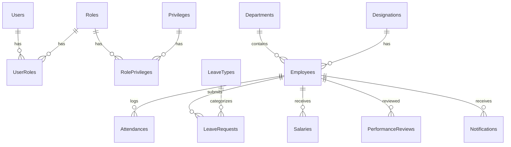

# 🏢 Employee Management System — Project Documentation

> A **real-world, resume-worthy** ASP.NET Core Web API project with role-based auth, full CRUD, and business logic across 10+ modules.

---

## 📌 Tech Stack

| Layer            | Technology                                   |
| ---------------- | -------------------------------------------- |
| **Framework**    | ASP.NET Core 8 Web API                       |
| **ORM**          | Entity Framework Core (Code-First)           |
| **Database**     | SQL Server                                   |
| **Auth**         | JWT Bearer Tokens + Role-Based Authorization |
| **Validation**   | FluentValidation                             |
| **Mapping**      | AutoMapper (Entity ↔ DTO)                    |
| **Logging**      | Serilog                                      |
| **API Docs**     | Swagger / Swashbuckle                        |
| **Architecture** | Repository Pattern + Service Layer           |

---

## 🏗️ Project Architecture

```
EmployeeManagementSystem/
├── Controllers/          # API endpoints
├── Services/             # Business logic interfaces + implementations
├── Repositories/         # Data access interfaces + implementations
├── Models/               # Entity classes (DB tables)
├── DTOs/                 # Data Transfer Objects (Request/Response)
├── Data/                 # DbContext, Seed Data
├── Configurations/       # EF Fluent API configs
├── Validators/           # FluentValidation rules
├── Middleware/            # Custom middleware (exception handling, logging)
├── Helpers/              # Utility classes (pagination, email, file upload)
├── Migrations/           # EF Migrations
├── Program.cs            # App entry point + DI registration
└── appsettings.json      # Config (connection string, JWT keys)
```

---

## 🗄️ Database Schema

### ER Diagram



### Tables Summary

| #   | Table                  | Key Columns                                                                                                                                                      |
| --- | ---------------------- | ---------------------------------------------------------------------------------------------------------------------------------------------------------------- |
| 1   | **Users**              | Id, Username, PasswordHash, Email, IsActive, CreatedAt                                                                                                           |
| 2   | **Roles**              | Id, RoleName, Description                                                                                                                                        |
| 3   | **UserRoles**          | Id, UserId (FK), RoleId (FK)                                                                                                                                     |
| 4   | **Privileges**         | Id, PrivilegeName, Description                                                                                                                                   |
| 5   | **RolePrivileges**     | Id, RoleId (FK), PrivilegeId (FK)                                                                                                                                |
| 6   | **Departments**        | Id, DepartmentName, Description, IsActive                                                                                                                        |
| 7   | **Designations**       | Id, DesignationName, Description, IsActive                                                                                                                       |
| 8   | **Employees**          | Id, FirstName, LastName, Email, Phone, DOB, Gender, Address, JoinDate, DepartmentId (FK), DesignationId (FK), ManagerId (FK → self), Salary, PhotoPath, IsActive |
| 9   | **Attendances**        | Id, EmployeeId (FK), Date, CheckIn, CheckOut, TotalHours, Status                                                                                                 |
| 10  | **LeaveTypes**         | Id, TypeName, MaxDaysPerYear, Description                                                                                                                        |
| 11  | **LeaveRequests**      | Id, EmployeeId (FK), LeaveTypeId (FK), StartDate, EndDate, TotalDays, Reason, Status, ApprovedById, ApprovedDate, Comments                                       |
| 12  | **Salaries**           | Id, EmployeeId (FK), Month, Year, Basic, HRA, DA, TravelAllowance, Bonus, PF, Tax, Insurance, NetSalary, GeneratedDate                                           |
| 13  | **PerformanceReviews** | Id, EmployeeId (FK), ReviewerId (FK), ReviewPeriod, Rating, Strengths, Weaknesses, Comments, Goals, ReviewDate                                                   |
| 14  | **Notifications**      | Id, EmployeeId (FK), Title, Message, IsRead, CreatedAt                                                                                                           |

> **💡 Tip:** Add `CreatedAt`, `CreatedBy`, `UpdatedAt`, `UpdatedBy` audit fields to every table.

---

## 🔐 Roles & Access Control

| Role         | Access Level                                       |
| ------------ | -------------------------------------------------- |
| **Admin**    | Full system access — manage everything             |
| **HR**       | Manage employees, attendance, leaves, salaries     |
| **Manager**  | View team, approve leaves, submit reviews          |
| **Employee** | View own profile, mark attendance, apply for leave |

---

## 📡 API Endpoints (82 Total)

---

### Module 1: Authentication & Authorization (13 Endpoints)

| #   | Method   | Endpoint                             | Description                | Auth          |
| --- | -------- | ------------------------------------ | -------------------------- | ------------- |
| 1   | `POST`   | `/api/auth/register`                 | Register a new user        | Public        |
| 2   | `POST`   | `/api/auth/login`                    | Login and get JWT token    | Public        |
| 3   | `POST`   | `/api/auth/refresh-token`            | Refresh expired JWT token  | Authenticated |
| 4   | `POST`   | `/api/auth/change-password`          | Change own password        | Authenticated |
| 5   | `GET`    | `/api/roles`                         | Get all roles              | Admin         |
| 6   | `POST`   | `/api/roles`                         | Create a new role          | Admin         |
| 7   | `PUT`    | `/api/roles/{id}`                    | Update a role              | Admin         |
| 8   | `DELETE` | `/api/roles/{id}`                    | Delete a role              | Admin         |
| 9   | `GET`    | `/api/privileges`                    | Get all privileges         | Admin         |
| 10  | `POST`   | `/api/privileges`                    | Create a privilege         | Admin         |
| 11  | `POST`   | `/api/role-privileges`               | Assign privilege to role   | Admin         |
| 12  | `DELETE` | `/api/role-privileges/{id}`          | Remove privilege from role | Admin         |
| 13  | `GET`    | `/api/role-privileges/role/{roleId}` | Get privileges by role     | Admin         |

---

### Module 2: Employee Management — Core Module (12 Endpoints)

| #   | Method   | Endpoint                                         | Description                               | Auth               |
| --- | -------- | ------------------------------------------------ | ----------------------------------------- | ------------------ |
| 14  | `GET`    | `/api/employees`                                 | Get all employees (paginated, filterable) | HR, Admin          |
| 15  | `GET`    | `/api/employees/{id}`                            | Get employee by ID                        | HR, Admin, Self    |
| 16  | `POST`   | `/api/employees`                                 | Create new employee                       | HR, Admin          |
| 17  | `PUT`    | `/api/employees/{id}`                            | Update employee details                   | HR, Admin          |
| 18  | `DELETE` | `/api/employees/{id}`                            | Soft-delete an employee                   | Admin              |
| 19  | `GET`    | `/api/employees/search?name=&dept=&designation=` | Search employees with filters             | HR, Admin          |
| 20  | `GET`    | `/api/employees/department/{deptId}`             | Get employees by department               | HR, Admin, Manager |
| 21  | `GET`    | `/api/employees/manager/{managerId}`             | Get employees under a manager             | Manager            |
| 22  | `POST`   | `/api/employees/{id}/photo`                      | Upload employee photo                     | HR, Admin          |
| 23  | `GET`    | `/api/employees/{id}/photo`                      | Get employee photo                        | Authenticated      |
| 24  | `GET`    | `/api/employees/me`                              | Get own profile                           | Employee           |
| 25  | `PUT`    | `/api/employees/me`                              | Update own profile (limited fields)       | Employee           |

**Key Features:**

- Pagination: `?page=1&pageSize=10`
- Sorting: `?sortBy=name&sortOrder=asc`
- Filtering: by department, designation, status, join date range
- Soft Delete: `IsActive = false` instead of hard delete

---

### Module 3: Department Management (6 Endpoints)

| #   | Method   | Endpoint                          | Description                   | Auth               |
| --- | -------- | --------------------------------- | ----------------------------- | ------------------ |
| 26  | `GET`    | `/api/departments`                | Get all departments           | Authenticated      |
| 27  | `GET`    | `/api/departments/{id}`           | Get department by ID          | Authenticated      |
| 28  | `POST`   | `/api/departments`                | Create department             | Admin, HR          |
| 29  | `PUT`    | `/api/departments/{id}`           | Update department             | Admin, HR          |
| 30  | `DELETE` | `/api/departments/{id}`           | Delete department             | Admin              |
| 31  | `GET`    | `/api/departments/{id}/employees` | Get employees in a department | HR, Admin, Manager |

---

### Module 4: Designation Management (5 Endpoints)

| #   | Method   | Endpoint                 | Description           | Auth          |
| --- | -------- | ------------------------ | --------------------- | ------------- |
| 32  | `GET`    | `/api/designations`      | Get all designations  | Authenticated |
| 33  | `GET`    | `/api/designations/{id}` | Get designation by ID | Authenticated |
| 34  | `POST`   | `/api/designations`      | Create designation    | Admin, HR     |
| 35  | `PUT`    | `/api/designations/{id}` | Update designation    | Admin, HR     |
| 36  | `DELETE` | `/api/designations/{id}` | Delete designation    | Admin         |

---

### Module 5: Attendance & Time Tracking (8 Endpoints)

| #   | Method | Endpoint                                        | Description                          | Auth               |
| --- | ------ | ----------------------------------------------- | ------------------------------------ | ------------------ |
| 37  | `POST` | `/api/attendance/check-in`                      | Mark check-in for today              | Employee           |
| 38  | `POST` | `/api/attendance/check-out`                     | Mark check-out for today             | Employee           |
| 39  | `GET`  | `/api/attendance/me?month=&year=`               | Get own attendance history           | Employee           |
| 40  | `GET`  | `/api/attendance/employee/{empId}?month=&year=` | Get attendance by employee           | HR, Admin, Manager |
| 41  | `GET`  | `/api/attendance/department/{deptId}?date=`     | Get department attendance for a date | HR, Admin, Manager |
| 42  | `GET`  | `/api/attendance/today`                         | Get today's attendance summary       | HR, Admin          |
| 43  | `PUT`  | `/api/attendance/{id}`                          | Correct/update attendance record     | HR, Admin          |
| 44  | `GET`  | `/api/attendance/report?month=&year=`           | Monthly attendance report            | HR, Admin          |

**Business Logic:**

- Auto-calculate `TotalWorkHours = CheckOut - CheckIn`
- Status: `Present`, `Absent`, `HalfDay`, `Late`, `On Leave`
- Prevent duplicate check-in for the same day

---

### Module 6: Leave Management (13 Endpoints)

| #   | Method   | Endpoint                          | Description                    | Auth               |
| --- | -------- | --------------------------------- | ------------------------------ | ------------------ |
| 45  | `GET`    | `/api/leave-types`                | Get all leave types            | Authenticated      |
| 46  | `POST`   | `/api/leave-types`                | Create leave type              | Admin, HR          |
| 47  | `PUT`    | `/api/leave-types/{id}`           | Update leave type              | Admin, HR          |
| 48  | `DELETE` | `/api/leave-types/{id}`           | Delete leave type              | Admin              |
| 49  | `POST`   | `/api/leaves`                     | Apply for leave                | Employee           |
| 50  | `GET`    | `/api/leaves/me`                  | Get own leave requests         | Employee           |
| 51  | `GET`    | `/api/leaves/me/balance`          | Get own leave balance          | Employee           |
| 52  | `GET`    | `/api/leaves/employee/{empId}`    | Get leave requests by employee | HR, Admin, Manager |
| 53  | `GET`    | `/api/leaves/pending`             | Get all pending leave requests | HR, Admin, Manager |
| 54  | `PUT`    | `/api/leaves/{id}/approve`        | Approve a leave request        | Manager, HR, Admin |
| 55  | `PUT`    | `/api/leaves/{id}/reject`         | Reject a leave request         | Manager, HR, Admin |
| 56  | `DELETE` | `/api/leaves/{id}`                | Cancel own leave request       | Employee           |
| 57  | `GET`    | `/api/leaves/report?month=&year=` | Leave summary report           | HR, Admin          |

**Business Logic:**

- Leave balance per type per year (e.g., 12 Casual, 10 Sick, 15 Earned)
- Cannot apply if balance is 0
- Auto-update attendance to "On Leave" when leave is approved
- Manager can only approve leaves for their own team
- Notification sent on approval/rejection

---

### Module 7: Payroll & Salary (6 Endpoints)

| #   | Method | Endpoint                                    | Description                               | Auth      |
| --- | ------ | ------------------------------------------- | ----------------------------------------- | --------- |
| 58  | `POST` | `/api/salary/generate?month=&year=`         | Generate monthly salary for all employees | Admin, HR |
| 59  | `GET`  | `/api/salary/me?month=&year=`               | Get own salary slip                       | Employee  |
| 60  | `GET`  | `/api/salary/employee/{empId}?month=&year=` | Get salary by employee                    | HR, Admin |
| 61  | `GET`  | `/api/salary/all?month=&year=`              | Get all salary records for a month        | HR, Admin |
| 62  | `PUT`  | `/api/salary/{id}`                          | Update/correct a salary record            | Admin     |
| 63  | `GET`  | `/api/salary/report?year=`                  | Yearly salary report                      | Admin     |

**Salary Breakdown:**

| Component                  | Type                                |
| -------------------------- | ----------------------------------- |
| Basic Salary               | Earning                             |
| HRA (House Rent Allowance) | Earning                             |
| DA (Dearness Allowance)    | Earning                             |
| Travel Allowance           | Earning                             |
| Bonus                      | Earning                             |
| PF (Provident Fund)        | Deduction                           |
| Tax (TDS)                  | Deduction                           |
| Insurance                  | Deduction                           |
| **Net Salary**             | **Basic + Allowances − Deductions** |

---

### Module 8: Performance Reviews (6 Endpoints)

| #   | Method   | Endpoint                                 | Description                 | Auth                     |
| --- | -------- | ---------------------------------------- | --------------------------- | ------------------------ |
| 64  | `POST`   | `/api/reviews`                           | Create a performance review | Manager, HR              |
| 65  | `GET`    | `/api/reviews/employee/{empId}`          | Get reviews for an employee | HR, Admin, Manager, Self |
| 66  | `GET`    | `/api/reviews/me`                        | Get own reviews             | Employee                 |
| 67  | `PUT`    | `/api/reviews/{id}`                      | Update a review             | Manager, HR              |
| 68  | `DELETE` | `/api/reviews/{id}`                      | Delete a review             | Admin                    |
| 69  | `GET`    | `/api/reviews/department/{deptId}?year=` | Department review summary   | HR, Admin                |

**Review Fields:** Reviewer (Manager ID), Review Period, Rating (1–5), Strengths, Weaknesses, Comments, Goals for next period

---

### Module 9: Notifications (5 Endpoints)

| #   | Method   | Endpoint                       | Description                        | Auth          |
| --- | -------- | ------------------------------ | ---------------------------------- | ------------- |
| 70  | `GET`    | `/api/notifications/me`        | Get own notifications              | Authenticated |
| 71  | `PUT`    | `/api/notifications/{id}/read` | Mark notification as read          | Authenticated |
| 72  | `PUT`    | `/api/notifications/read-all`  | Mark all as read                   | Authenticated |
| 73  | `DELETE` | `/api/notifications/{id}`      | Delete a notification              | Authenticated |
| 74  | `POST`   | `/api/notifications/broadcast` | Send notification to all employees | Admin, HR     |

---

### Module 10: Dashboard & Reports (8 Endpoints)

| #   | Method | Endpoint                                          | Description                                              | Auth      |
| --- | ------ | ------------------------------------------------- | -------------------------------------------------------- | --------- |
| 75  | `GET`  | `/api/dashboard/summary`                          | Overall summary (total employees, depts, pending leaves) | Admin, HR |
| 76  | `GET`  | `/api/dashboard/attendance-overview?month=&year=` | Attendance stats for charts                              | Admin, HR |
| 77  | `GET`  | `/api/dashboard/department-stats`                 | Employee count per department                            | Admin, HR |
| 78  | `GET`  | `/api/dashboard/leave-stats?year=`                | Leave usage statistics                                   | Admin, HR |
| 79  | `GET`  | `/api/dashboard/salary-stats?year=`               | Monthly salary expenditure                               | Admin     |
| 80  | `GET`  | `/api/reports/employees`                          | Export employee list (CSV/Excel)                         | Admin, HR |
| 81  | `GET`  | `/api/reports/attendance?month=&year=`            | Export attendance report                                 | Admin, HR |
| 82  | `GET`  | `/api/reports/salary?month=&year=`                | Export salary report                                     | Admin     |

---

## 📊 Endpoint Summary

| Module                     | Endpoints |
| -------------------------- | --------- |
| Auth & Authorization       | 13        |
| Employee Management        | 12        |
| Department Management      | 6         |
| Designation Management     | 5         |
| Attendance & Time Tracking | 8         |
| Leave Management           | 13        |
| Payroll & Salary           | 6         |
| Performance Reviews        | 6         |
| Notifications              | 5         |
| Dashboard & Reports        | 8         |
| **Total**                  | **82**    |

---

## 🔧 Cross-Cutting Features (Resume Highlights)

| #   | Feature                       | Description                                                       |
| --- | ----------------------------- | ----------------------------------------------------------------- |
| 1   | **JWT Authentication**        | Token-based auth with refresh tokens                              |
| 2   | **Role-Based Authorization**  | 4 roles with endpoint-level permissions                           |
| 3   | **Global Exception Handling** | Custom middleware for consistent error responses                  |
| 4   | **Request Validation**        | FluentValidation for all DTOs                                     |
| 5   | **Pagination & Sorting**      | Reusable pagination helper for all list endpoints                 |
| 6   | **Soft Delete**               | `IsActive` flag instead of hard deletes                           |
| 7   | **Audit Fields**              | `CreatedAt`, `CreatedBy`, `UpdatedAt`, `UpdatedBy` on every table |
| 8   | **AutoMapper Profiles**       | Clean Entity ↔ DTO mapping                                        |
| 9   | **Repository Pattern**        | Abstracted data access layer                                      |
| 10  | **Serilog Logging**           | Structured logging with file/console sinks                        |
| 11  | **File Upload**               | Employee photo upload with validation                             |
| 12  | **API Versioning**            | `/api/v1/...` for future-proofing                                 |
| 13  | **CORS Configuration**        | Cross-origin support for frontend                                 |
| 14  | **Swagger/OpenAPI**           | Interactive API documentation                                     |
| 15  | **Seed Data**                 | Pre-populate roles, departments, designations                     |

---

## 📦 Build Order (Follow This Sequence)

| Phase | Module                           | Why This Order                             |
| ----- | -------------------------------- | ------------------------------------------ |
| 1     | **Project Setup + Architecture** | Solution, folders, DbContext, Program.cs   |
| 2     | **Auth & Roles**                 | Everything else depends on authentication  |
| 3     | **Departments & Designations**   | Employee depends on these master tables    |
| 4     | **Employee Management**          | Core entity, depends on Dept & Designation |
| 5     | **Attendance**                   | Depends on Employee                        |
| 6     | **Leave Management**             | Depends on Employee + LeaveTypes           |
| 7     | **Payroll & Salary**             | Depends on Employee + Attendance           |
| 8     | **Performance Reviews**          | Depends on Employee                        |
| 9     | **Notifications**                | Depends on all modules (event-driven)      |
| 10    | **Dashboard & Reports**          | Aggregates data from all modules           |

---

## 🚀 Resume Description

```
Employee Management System — ASP.NET Core 8 Web API
────────────────────────────────────────────────────
• Designed and built a comprehensive Employee Management System backend
  with 82+ RESTful API endpoints across 10 modules
• Implemented JWT authentication with refresh tokens, role-based
  authorization (Admin, HR, Manager, Employee), and granular privilege control
• Built modules for Employee CRUD, Attendance Tracking, Leave Management
  with approval workflows, Payroll Generation, and Performance Reviews
• Used Entity Framework Core (Code-First) with SQL Server,
  Repository + Service pattern, AutoMapper, and FluentValidation
• Added pagination, sorting, filtering, soft-delete, audit trails,
  file uploads, global exception handling, and Serilog structured logging
• Documented all APIs with Swagger/OpenAPI and implemented API Versioning

Tech: C#, ASP.NET Core 8, EF Core, SQL Server, JWT, Swagger, Serilog, AutoMapper
```

---

> **🎯 Good luck building this project! Follow the build order, commit after each module, and test every endpoint in Swagger. You've got this!** 💪
