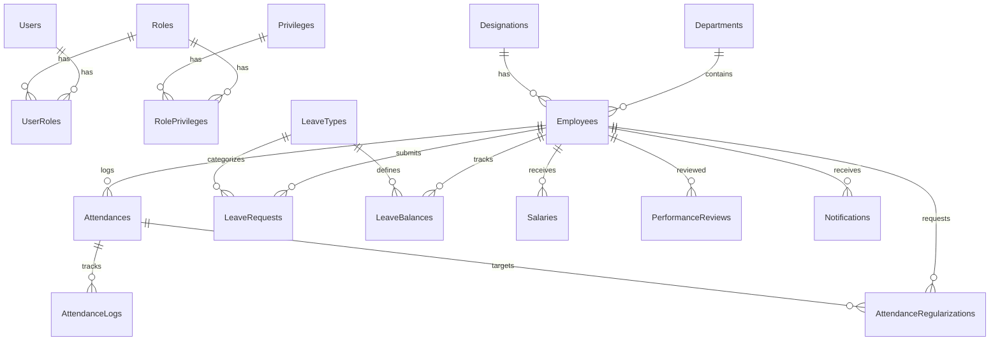

# Employee Management System — Project Documentation

> ASP.NET Core 8 Web API with permission-based authorization, full CRUD operations, and business logic across 11 modules.

---

## Tech Stack

| Layer            | Technology                                        |
| ---------------- | ------------------------------------------------- |
| **Framework**    | ASP.NET Core 8 Web API                            |
| **ORM**          | Entity Framework Core (Code-First)                |
| **Database**     | SQL Server                                        |
| **Auth**         | JWT (RSA asymmetric keys) + Permission-Based Auth |
| **Mapping**      | AutoMapper (Entity ↔ DTO)                         |
| **Logging**      | Serilog (Console + File sinks)                    |
| **API Docs**     | Swagger / Swashbuckle                             |
| **Architecture** | Clean Architecture + Repository + Service + UnitOfWork |
| **Email**        | SMTP (Gmail) for OTP-based password reset         |
| **Caching**      | In-Memory Cache (for OTP storage)                 |

---

## Project Architecture

The solution follows **Clean Architecture** with four separate projects and a test project:

```
EmpMS.slnx
│
├── Domain/                          # Core domain layer (no dependencies)
│   ├── Entities/                    # Entity classes mapping to DB tables
│   ├── Interfaces/                  # Repository interfaces + service contracts
│   └── Exceptions/                  # Custom exception types
│
├── Application/                     # Application/business logic layer
│   ├── DTOs/                        # Data Transfer Objects (Request/Response)
│   │   ├── Attendance/
│   │   ├── Auth/
│   │   ├── Dashboard/
│   │   ├── Department/
│   │   ├── Designation/
│   │   ├── Employee/
│   │   ├── Leave/
│   │   ├── Notification/
│   │   ├── Review/
│   │   └── Salary/
│   ├── Services/                    # Business logic implementations
│   ├── Interfaces/                  # Service interfaces
│   ├── Mappings/                    # AutoMapper profiles
│   ├── Common/                      # Shared classes (APIResponse, PaginatedResult)
│   └── DependencyInjection.cs       # Application-layer DI registration
│
├── Infrastructure/                  # Data access & external services
│   ├── Data/
│   │   ├── AppDbContext.cs          # EF Core DbContext
│   │   ├── UnitOfWork.cs           # UnitOfWork implementation
│   │   └── Configurations/         # EF Fluent API entity configurations + seed data
│   ├── Repositories/               # Repository implementations
│   ├── Services/                   # Infrastructure services (JwtHelper, EmailService)
│   ├── Migrations/                 # EF Core migrations
│   └── DependencyInjection.cs      # Infrastructure-layer DI registration
│
├── EmpMS/                          # API / Presentation layer
│   ├── Controllers/                # API endpoint controllers
│   ├── Middleware/                  # ExceptionMiddleware, RequestLoggingMiddleware
│   ├── Authorization/              # PermissionHandler, PermissionPolicyProvider
│   ├── Attributes/                 # HasPermissionAttribute
│   ├── Keys/                       # RSA key files (private.key, public.key)
│   ├── wwwroot/                    # Static files (employee photos)
│   ├── Program.cs                  # App entry point + DI registration
│   └── appsettings.json            # Config (connection string, JWT, email, logging)
│
└── EmpMS.Tests/                    # Unit test project
    └── UnitTests/
        └── Services/               # Service-layer unit tests
```

---

## Database Schema

### ER Diagram




### Tables

| #   | Table                         | Key Columns |
| --- | ----------------------------- | ----------- |
| 1   | **Users**                     | Id, Username, PasswordHash, Email, IsActive, CreatedAt, RefreshToken, RefreshTokenExpiryTime, EmployeeId (FK), MustChangePassword, CreatedBy |
| 2   | **Roles**                     | Id, RoleName, Description |
| 3   | **UserRoles**                 | Id, UserId (FK), RoleId (FK) |
| 4   | **Privileges**                | Id, PrivilegeName, Description |
| 5   | **RolePrivileges**            | Id, RoleId (FK), PrivilegeId (FK) |
| 6   | **Departments**               | Id, DepartmentName, Description, IsActive, CreatedAt, CreatedBy, UpdatedAt, UpdatedBy |
| 7   | **Designations**              | Id, DesignationName, Description, IsActive, CreatedAt, CreatedBy, UpdatedAt, UpdatedBy |
| 8   | **Employees**                 | Id, FirstName, LastName, Email, Phone, DOB, Gender, Address, JoinDate, DepartmentId (FK), DesignationId (FK), ManagerId (FK → self), AnnualCTC, PhotoPath, IsActive, CreatedAt, CreatedBy, UpdatedAt, UpdatedBy |
| 9   | **Attendances**               | Id, EmployeeId (FK), Date, TotalHours, IsLate, Status, IsCheckedIn, CreatedAt, CreatedBy, UpdatedAt, UpdatedBy |
| 10  | **AttendanceLogs**            | Id, AttendanceId (FK), CheckIn, CheckOut, SessionHours, CreatedAt |
| 11  | **AttendanceRegularizations** | Id, EmployeeId (FK), AttendanceId (FK), Date, RequestedCheckOut, Note, Status, HRorAdminId (FK → Users), DecisionDate, DecisionNote, CreatedAt |
| 12  | **LeaveTypes**                | Id, Name, Description, DefaultDays, IsPaid, IsActive, CreatedAt, CreatedBy, UpdatedAt, UpdatedBy |
| 13  | **LeaveBalances**             | Id, EmployeeId (FK), LeaveTypeId (FK), Year, TotalLeaves, UsedLeaves, RemainingLeaves |
| 14  | **LeaveRequests**             | Id, EmployeeId (FK), LeaveTypeId (FK), StartDate, EndDate, TotalDays, Reason, Status, ApprovedById (FK → Users), DecisionDate, DecisionNote, CreatedAt, UpdatedAt |
| 15  | **Salaries**                  | Id, EmployeeId (FK), Month, Year, AnnualCTC, Basic, HRA, DA, TravelAllowance, SpecialAllowance, Bonus, EmployeePF, ProfessionalTax, IncomeTax, EmployerPF, Gratuity, TotalWorkingDays, PresentDays, PaidLeaveDays, UnpaidLeaveDays, HalfDays, AbsentDays, LopDeduction, GrossEarnings, TotalDeductions, NetSalary, PayslipStatus, GeneratedDate, GeneratedBy, CreatedAt, CreatedBy, UpdatedAt, UpdatedBy |
| 16  | **SalaryStructures**          | Id, ComponentName, ComponentType, CalculationType, Value, MaxLimit, IsActive, DisplayOrder, CreatedAt, CreatedBy, UpdatedAt, UpdatedBy |
| 17  | **PerformanceReviews**        | Id, EmployeeId (FK), ReviewerId (FK → Employees), ReviewPeriod, Rating, Strengths, Weaknesses, Comments, Goals, ReviewDate, CreatedAt, CreatedBy, UpdatedAt, UpdatedBy |
| 18  | **Notifications**             | Id, EmployeeId (FK), Title, Message, Type, IsRead, ReadAt, CreatedAt, CreatedBy |

---

## Authorization Model

This project uses a **custom permission-based authorization system**, not simple role-based `[Authorize(Roles = "...")]`.

### How It Works

1. **Roles** are assigned to **Users** via the `UserRoles` table
2. **Privileges** (e.g., `Employee.Read`, `Salary.Create`) are assigned to **Roles** via the `RolePrivileges` table
3. Controllers use the custom `[HasPermission("Employee.Read")]` attribute
4. `PermissionPolicyProvider` dynamically creates authorization policies for each permission string
5. `PermissionHandler` checks if the current user's role has the required privilege

### Predefined Roles

| Role         | Description                                        |
| ------------ | -------------------------------------------------- |
| **Admin**    | Full system access — all privileges assigned       |
| **HR**       | Manage employees, attendance, leaves, salaries     |
| **Manager**  | View team, approve leaves, submit reviews          |
| **Employee** | View own profile, mark attendance, apply for leave |

### Key Files

| File | Purpose |
|------|---------|
| `EmpMS/Attributes/HasPermissionAttribute.cs` | Custom `[HasPermission]` attribute that creates an `AuthorizeAttribute` with a permission-based policy |
| `EmpMS/Authorization/PermissionRequirement.cs` | Defines the permission requirement |
| `EmpMS/Authorization/PermissionPolicyProvider.cs` | Dynamically generates authorization policies from permission strings |
| `EmpMS/Authorization/PermissionHandler.cs` | Validates user's role privileges against the required permission |

---

## API Endpoints (93 Total)

---

### Module 1: Authentication (6 Endpoints)

Controller: `AuthController` — Route: `api/auth`

| #   | Method | Endpoint                        | Description                     | Auth                       |
| --- | ------ | ------------------------------- | ------------------------------- | -------------------------- |
| 1   | `POST` | `/api/auth/create-user`         | Create a new user account       | `[HasPermission("User.Create")]` |
| 2   | `POST` | `/api/auth/login`               | Login and get JWT (set as cookie) | Public                   |
| 3   | `POST` | `/api/auth/forgot-password`     | Send OTP to email for password reset | Public                |
| 4   | `POST` | `/api/auth/reset-password-otp`  | Reset password using OTP        | Public                     |
| 5   | `POST` | `/api/auth/refresh-token`       | Refresh expired JWT token (reads from cookies) | Public        |
| 6   | `POST` | `/api/auth/change-password`     | Change own password             | Authenticated              |

**Implementation Details:**
- JWT tokens are signed with **RSA asymmetric keys** (private key signs, public key verifies)
- Tokens are stored in **HttpOnly, Secure, SameSite=Strict cookies** (not in Authorization header)
- Access token expires in 15 minutes; refresh token expires in 7 days
- Forgot password uses OTP sent via SMTP email, cached in MemoryCache

---

### Module 2: Role Management (4 Endpoints)

Controller: `RolesController` — Route: `api/roles`

| #   | Method   | Endpoint          | Description     | Auth                          |
| --- | -------- | ----------------- | --------------- | ----------------------------- |
| 7   | `GET`    | `/api/roles`      | Get all roles   | `[HasPermission("Role.Manage")]` |
| 8   | `POST`   | `/api/roles`      | Create a role   | `[HasPermission("Role.Manage")]` |
| 9   | `PUT`    | `/api/roles/{id}` | Update a role   | `[HasPermission("Role.Manage")]` |
| 10  | `DELETE` | `/api/roles/{id}` | Delete a role   | `[HasPermission("Role.Manage")]` |

---

### Module 3: Privilege Management (5 Endpoints)

Controller: `PrivilegesController` — Route: `api/privileges`

| #   | Method   | Endpoint               | Description          | Auth                              |
| --- | -------- | ---------------------- | -------------------- | --------------------------------- |
| 11  | `GET`    | `/api/privileges`      | Get all privileges   | `[HasPermission("Privilege.Manage")]` |
| 12  | `GET`    | `/api/privileges/{id}` | Get privilege by ID  | `[HasPermission("Privilege.Manage")]` |
| 13  | `POST`   | `/api/privileges`      | Create a privilege   | `[HasPermission("Privilege.Manage")]` |
| 14  | `PUT`    | `/api/privileges/{id}` | Update a privilege   | `[HasPermission("Privilege.Manage")]` |
| 15  | `DELETE` | `/api/privileges/{id}` | Delete a privilege   | `[HasPermission("Privilege.Manage")]` |

---

### Module 4: Role-Privilege Mapping (3 Endpoints)

Controller: `RolePrivilegesController` — Route: `api/roleprivileges`

| #   | Method   | Endpoint                                  | Description                | Auth                              |
| --- | -------- | ----------------------------------------- | -------------------------- | --------------------------------- |
| 16  | `POST`   | `/api/roleprivileges`                     | Assign privilege to role   | `[HasPermission("Privilege.Manage")]` |
| 17  | `GET`    | `/api/roleprivileges/role/{roleId}`       | Get privileges by role     | `[HasPermission("Privilege.Manage")]` |
| 18  | `DELETE` | `/api/roleprivileges/{roleId}/{privilegeId}` | Remove privilege from role | `[HasPermission("Privilege.Manage")]` |

---

### Module 5: Employee Management (12 Endpoints)

Controller: `EmployeesController` — Route: `api/employees`

| #   | Method   | Endpoint                                | Description                               | Auth                                |
| --- | -------- | --------------------------------------- | ----------------------------------------- | ----------------------------------- |
| 19  | `GET`    | `/api/employees`                        | Get all employees (paginated, sortable)   | `[HasPermission("Employee.Read")]`  |
| 20  | `GET`    | `/api/employees/{id}`                   | Get employee by ID                        | `[HasPermission("Employee.Read")]`  |
| 21  | `POST`   | `/api/employees`                        | Create new employee                       | `[HasPermission("Employee.Create")]` |
| 22  | `PUT`    | `/api/employees/{id}`                   | Update employee details                   | `[HasPermission("Employee.Update")]` |
| 23  | `DELETE` | `/api/employees/{id}`                   | Soft-delete an employee                   | `[HasPermission("Employee.Delete")]` |
| 24  | `GET`    | `/api/employees/search?name=&dept=&designation=` | Search employees with filters      | `[HasPermission("Employee.Read")]`  |
| 25  | `GET`    | `/api/employees/department/{deptId}`    | Get employees by department               | `[HasPermission("Employee.Read")]`  |
| 26  | `GET`    | `/api/employees/manager/{managerId}`   | Get employees under a manager             | `[HasPermission("Employee.Read")]`  |
| 27  | `GET`    | `/api/employees/me`                     | Get own profile                           | Authenticated                       |
| 28  | `PUT`    | `/api/employees/me`                     | Update own profile (limited fields)       | Authenticated                       |
| 29  | `POST`   | `/api/employees/{id}/photo`             | Upload employee photo                     | `[HasPermission("Employee.Update")]` |
| 30  | `GET`    | `/api/employees/{id}/photo`             | Get employee photo                        | `[HasPermission("Employee.Read")]`  |

**Features:**
- Pagination: `?page=1&pageSize=10`
- Sorting: `?sortBy=name&sortOrder=asc`
- Search: by name, department ID, designation ID
- Soft Delete: `IsActive = false` instead of hard delete
- Photo upload served from `wwwroot/`

---

### Module 6: Department Management (6 Endpoints)

Controller: `DepartmentsController` — Route: `api/departments`

| #   | Method   | Endpoint                          | Description                   | Auth                                  |
| --- | -------- | --------------------------------- | ----------------------------- | ------------------------------------- |
| 31  | `GET`    | `/api/departments`                | Get all departments           | `[HasPermission("Department.Read")]`  |
| 32  | `GET`    | `/api/departments/{id}`           | Get department by ID          | `[HasPermission("Department.Read")]`  |
| 33  | `POST`   | `/api/departments`                | Create department             | `[HasPermission("Department.Create")]` |
| 34  | `PUT`    | `/api/departments/{id}`           | Update department             | `[HasPermission("Department.Update")]` |
| 35  | `DELETE` | `/api/departments/{id}`           | Delete department             | `[HasPermission("Department.Delete")]` |
| 36  | `GET`    | `/api/departments/{id}/employees` | Get employees in a department | `[HasPermission("Employee.Read")]`    |

---

### Module 7: Designation Management (5 Endpoints)

Controller: `DesignationsController` — Route: `api/designations`

| #   | Method   | Endpoint                 | Description           | Auth                                    |
| --- | -------- | ------------------------ | --------------------- | --------------------------------------- |
| 37  | `GET`    | `/api/designations`      | Get all designations  | `[HasPermission("Designation.Read")]`   |
| 38  | `GET`    | `/api/designations/{id}` | Get designation by ID | `[HasPermission("Designation.Read")]`   |
| 39  | `POST`   | `/api/designations`      | Create designation    | `[HasPermission("Designation.Create")]` |
| 40  | `PUT`    | `/api/designations/{id}` | Update designation    | `[HasPermission("Designation.Update")]` |
| 41  | `DELETE` | `/api/designations/{id}` | Delete designation    | `[HasPermission("Designation.Delete")]` |

---

### Module 8: Attendance & Time Tracking (8 Endpoints)

Controller: `AttendanceController` — Route: `api/attendance`

| #   | Method | Endpoint                                        | Description                          | Auth                                      |
| --- | ------ | ----------------------------------------------- | ------------------------------------ | ----------------------------------------- |
| 42  | `POST` | `/api/attendance/check-in`                      | Mark check-in for today              | Authenticated                             |
| 43  | `POST` | `/api/attendance/check-out`                     | Mark check-out for today             | Authenticated                             |
| 44  | `GET`  | `/api/attendance/me?month=&year=`               | Get own attendance history           | Authenticated                             |
| 45  | `GET`  | `/api/attendance/employee/{empId}?month=&year=` | Get attendance by employee           | `[HasPermission("Attendance.Read")]`      |
| 46  | `GET`  | `/api/attendance/department/{deptId}?date=`     | Get department attendance for a date | `[HasPermission("Attendance.Read")]`      |
| 47  | `GET`  | `/api/attendance/today`                         | Get today's attendance summary       | `[HasPermission("Attendance.ReadReport")]` |
| 48  | `PUT`  | `/api/attendance/{id}`                          | Correct/update attendance record     | `[HasPermission("Attendance.Update")]`    |
| 49  | `GET`  | `/api/attendance/report?month=&year=`           | Monthly attendance report            | `[HasPermission("Attendance.ReadReport")]` |

**Implementation Details:**
- Attendance uses a parent-child model: `Attendance` (daily record) → `AttendanceLogs` (individual check-in/check-out sessions)
- Auto-calculates `TotalHours` from `AttendanceLogs.SessionHours`
- Tracks `IsLate` flag and `IsCheckedIn` state
- Status values: `Present`, `Absent`, `HalfDay`, `Late`, `On Leave`
- Prevents duplicate check-in for the same day

---

### Module 9: Attendance Regularization (6 Endpoints)

Controller: `AttendanceRegularizationController` — Route: `api/attendanceregularization`

| #   | Method | Endpoint                                         | Description                         | Auth                                   |
| --- | ------ | ------------------------------------------------ | ----------------------------------- | -------------------------------------- |
| 50  | `POST` | `/api/attendanceregularization/request`          | Submit regularization request       | Authenticated                          |
| 51  | `GET`  | `/api/attendanceregularization/my-request`       | Get own regularization requests     | Authenticated                          |
| 52  | `GET`  | `/api/attendanceregularization/pending`          | Get all pending requests            | `[HasPermission("Attendance.Update")]` |
| 53  | `PUT`  | `/api/attendanceregularization/{id}/approve`     | Approve regularization request      | `[HasPermission("Attendance.Update")]` |
| 54  | `PUT`  | `/api/attendanceregularization/{id}/reject`      | Reject regularization request       | `[HasPermission("Attendance.Update")]` |
| 55  | `GET`  | `/api/attendanceregularization/missed-checkouts` | Get days with missed check-outs     | Authenticated                          |

**Implementation Details:**
- Employees who forgot to check out can submit a regularization request with their intended check-out time
- HR/Admin reviews and approves or rejects the request
- On approval, the attendance record is updated with the corrected check-out time

---

### Module 10: Leave Management (13 Endpoints)

Controller: `LeaveController` — Route: `api/leave`

| #   | Method   | Endpoint                             | Description                    | Auth                                    |
| --- | -------- | ------------------------------------ | ------------------------------ | --------------------------------------- |
| 56  | `GET`    | `/api/leave/types`                   | Get all leave types            | `[HasPermission("Leave.Read")]`         |
| 57  | `GET`    | `/api/leave/types/{id}`              | Get leave type by ID           | `[HasPermission("Leave.Read")]`         |
| 58  | `POST`   | `/api/leave/types`                   | Create leave type              | `[HasPermission("Leave.Create")]`       |
| 59  | `PUT`    | `/api/leave/types/{id}`              | Update leave type              | `[HasPermission("Leave.Update")]`       |
| 60  | `DELETE` | `/api/leave/types/{id}`              | Delete leave type              | `[HasPermission("Leave.Delete")]`       |
| 61  | `GET`    | `/api/leave/balances?year=`          | Get own leave balance          | Authenticated                           |
| 62  | `POST`   | `/api/leave/balances/assign?employeeId=&year=` | Assign leave balances to employee | `[HasPermission("Leave.Create")]` |
| 63  | `POST`   | `/api/leave/requests`                | Apply for leave                | Authenticated                           |
| 64  | `GET`    | `/api/leave/requests/my`             | Get own leave requests         | Authenticated                           |
| 65  | `GET`    | `/api/leave/requests/pending`        | Get all pending leave requests | `[HasPermission("LeaveRequest.Update")]` |
| 66  | `PUT`    | `/api/leave/requests/{id}/approve`   | Approve a leave request        | `[HasPermission("LeaveRequest.Update")]` |
| 67  | `PUT`    | `/api/leave/requests/{id}/reject`    | Reject a leave request         | `[HasPermission("LeaveRequest.Update")]` |
| 68  | `PUT`    | `/api/leave/requests/{id}/cancel`    | Cancel own leave request       | Authenticated                           |

**Implementation Details:**
- Leave balances are tracked per employee, per leave type, per year via `LeaveBalances` table
- Each `LeaveType` defines `DefaultDays` and whether it `IsPaid`
- Cannot apply if remaining balance is 0
- Cancellation uses `PUT` (status change), not `DELETE`
- Decision notes are recorded on approval/rejection

---

### Module 11: Payroll & Salary (6 Endpoints)

Controller: `SalaryController` — Route: `api/salary`

| #   | Method | Endpoint                                    | Description                               | Auth                                 |
| --- | ------ | ------------------------------------------- | ----------------------------------------- | ------------------------------------ |
| 69  | `POST` | `/api/salary/generate?month=&year=`         | Generate monthly salary for all employees | `[HasPermission("Salary.Create")]`   |
| 70  | `GET`  | `/api/salary/me?month=&year=`               | Get own salary slip                       | Authenticated                        |
| 71  | `GET`  | `/api/salary/employee/{empId}?month=&year=` | Get salary by employee                    | `[HasPermission("Salary.Read")]`     |
| 72  | `GET`  | `/api/salary/all?month=&year=`              | Get all salary records for a month        | `[HasPermission("Salary.Read")]`     |
| 73  | `PUT`  | `/api/salary/{id}`                          | Update/correct a salary record            | `[HasPermission("Salary.Update")]`   |
| 74  | `GET`  | `/api/salary/report?year=`                  | Yearly salary report                      | `[HasPermission("Salary.Read")]`     |

**Salary Calculation:**

Salary generation uses the `SalaryStructures` table for configurable component definitions. Each component has a `CalculationType`:

| CalculationType   | Meaning                                                |
|--------------------|-------------------------------------------------------|
| `PercentageOfCTC`  | Component = (Value / 100) × (AnnualCTC / 12)          |
| `PercentageOfBasic`| Component = (Value / 100) × Basic                     |
| `Fixed`            | Component = fixed Value per month                     |
| `Remaining`        | Balancing figure (Gross − sum of other earnings)      |
| `TaxSlab`          | Income tax calculated via tax slabs                   |

**Salary Breakdown:**

| Component           | Type                  | Notes                                 |
| ------------------- | --------------------- | ------------------------------------- |
| Basic Salary        | Earning               | % of CTC                             |
| HRA                 | Earning               | % of CTC                             |
| DA                  | Earning               | % of CTC                             |
| Travel Allowance    | Earning               | % of CTC                             |
| Special Allowance   | Earning               | Balancing figure                      |
| Bonus               | Earning               | % of CTC                             |
| Employee PF         | Deduction             | 12% of Basic, max ₹1,800/month       |
| Professional Tax    | Deduction             | ₹200/month fixed                      |
| Income Tax (TDS)    | Deduction             | Monthly TDS via tax slabs             |
| Employer PF         | Employer Contribution | 12% of Basic, max ₹1,800 (not deducted from salary) |
| Gratuity            | Employer Contribution | 4.81% of Basic (not deducted from salary) |
| LOP Deduction       | Deduction             | (Gross / Calendar Days) × LOP days   |
| **Net Salary**      | **Total**             | **Gross Earnings − Total Deductions** |

**Attendance-Based Fields in Salary:**
- `TotalWorkingDays` — weekdays in the month
- `PresentDays`, `PaidLeaveDays`, `UnpaidLeaveDays`, `HalfDays`, `AbsentDays`
- `PayslipStatus`: `Generated`, `Corrected`, `OnHold`

---

### Module 12: Performance Reviews (6 Endpoints)

Controller: `ReviewsController` — Route: `api/reviews`

| #   | Method   | Endpoint                                 | Description                 | Auth                                  |
| --- | -------- | ---------------------------------------- | --------------------------- | ------------------------------------- |
| 75  | `POST`   | `/api/reviews`                           | Create a performance review | `[HasPermission("Review.Create")]`    |
| 76  | `GET`    | `/api/reviews/employee/{empId}`          | Get reviews for an employee | `[HasPermission("Review.Read")]`      |
| 77  | `GET`    | `/api/reviews/me`                        | Get own reviews             | Authenticated                         |
| 78  | `PUT`    | `/api/reviews/{id}`                      | Update a review             | `[HasPermission("Review.Update")]`    |
| 79  | `DELETE` | `/api/reviews/{id}`                      | Delete a review             | `[HasPermission("Review.Delete")]`    |
| 80  | `GET`    | `/api/reviews/department/{deptId}?year=` | Department review summary   | `[HasPermission("Review.Read")]`      |

**Review Fields:** EmployeeId (being reviewed), ReviewerId (from JWT EmployeeId claim), ReviewPeriod (e.g., "Q1-2026"), Rating (1–5), Strengths, Weaknesses, Comments, Goals

---

### Module 13: Notifications (5 Endpoints)

Controller: `NotificationsController` — Route: `api/notifications`

| #   | Method   | Endpoint                       | Description                        | Auth                                       |
| --- | -------- | ------------------------------ | ---------------------------------- | ------------------------------------------ |
| 81  | `GET`    | `/api/notifications/me`        | Get own notifications              | Authenticated                              |
| 82  | `PUT`    | `/api/notifications/{id}/read` | Mark notification as read          | Authenticated                              |
| 83  | `PUT`    | `/api/notifications/read-all`  | Mark all as read                   | Authenticated                              |
| 84  | `DELETE` | `/api/notifications/{id}`      | Delete a notification              | Authenticated                              |
| 85  | `POST`   | `/api/notifications/broadcast` | Send notification to all employees | `[HasPermission("Notification.Broadcast")]` |

**Notification Types:** `Leave`, `Salary`, `Review`, `Broadcast`, `System`

---

### Module 14: Dashboard (5 Endpoints)

Controller: `DashboardController` — Route: `api/dashboard`

| #   | Method | Endpoint                                          | Description                                              | Auth                                  |
| --- | ------ | ------------------------------------------------- | -------------------------------------------------------- | ------------------------------------- |
| 86  | `GET`  | `/api/dashboard/summary`                          | Overall summary (total employees, depts, pending leaves) | `[HasPermission("Dashboard.View")]`   |
| 87  | `GET`  | `/api/dashboard/attendance-overview?month=&year=` | Attendance stats for charts                              | `[HasPermission("Dashboard.View")]`   |
| 88  | `GET`  | `/api/dashboard/department-stats`                 | Employee count per department                            | `[HasPermission("Dashboard.View")]`   |
| 89  | `GET`  | `/api/dashboard/leave-stats?year=`                | Leave usage statistics                                   | `[HasPermission("Dashboard.View")]`   |
| 90  | `GET`  | `/api/dashboard/salary-stats?year=`               | Monthly salary expenditure                               | `[HasPermission("Report.Salary")]`    |

---

### Module 15: Reports — CSV Export (3 Endpoints)

Controller: `ReportsController` — Route: `api/reports`

| #   | Method | Endpoint                            | Description                  | Auth                                    |
| --- | ------ | ----------------------------------- | ---------------------------- | --------------------------------------- |
| 91  | `GET`  | `/api/reports/employees`            | Export employee list as CSV  | `[HasPermission("Report.Employees")]`   |
| 92  | `GET`  | `/api/reports/attendance?month=&year=` | Export attendance report as CSV | `[HasPermission("Report.Attendance")]` |
| 93  | `GET`  | `/api/reports/salary?month=&year=`  | Export salary report as CSV  | `[HasPermission("Report.Salary")]`      |

---

## Endpoint Summary

| Module                      | Controller                          | Endpoints |
| --------------------------- | ----------------------------------- | --------- |
| Authentication              | AuthController                      | 6         |
| Role Management             | RolesController                     | 4         |
| Privilege Management        | PrivilegesController                | 5         |
| Role-Privilege Mapping      | RolePrivilegesController            | 3         |
| Employee Management         | EmployeesController                 | 12        |
| Department Management       | DepartmentsController               | 6         |
| Designation Management      | DesignationsController              | 5         |
| Attendance & Time Tracking  | AttendanceController                | 8         |
| Attendance Regularization   | AttendanceRegularizationController  | 6         |
| Leave Management            | LeaveController                     | 13        |
| Payroll & Salary            | SalaryController                    | 6         |
| Performance Reviews         | ReviewsController                   | 6         |
| Notifications               | NotificationsController             | 5         |
| Dashboard                   | DashboardController                 | 5         |
| Reports (CSV Export)        | ReportsController                   | 3         |
| **Total**                   |                                     | **93**    |

---

## Cross-Cutting Concerns

| #   | Feature                             | Implementation                                                            |
| --- | ----------------------------------- | ------------------------------------------------------------------------- |
| 1   | **JWT Authentication (RSA)**        | Asymmetric RSA key pair signing; tokens stored in HttpOnly secure cookies |
| 2   | **Permission-Based Authorization**  | Custom `[HasPermission]` attribute + `PermissionHandler` + `PermissionPolicyProvider` |
| 3   | **Global Exception Handling**       | `ExceptionMiddleware` catches exceptions and returns consistent error responses |
| 4   | **Request Logging**                 | `RequestLoggingMiddleware` logs every incoming request                     |
| 5   | **Pagination & Sorting**            | `PaginatedResult<T>` helper for all list endpoints                       |
| 6   | **Soft Delete**                     | `IsActive` flag instead of hard deletes                                   |
| 7   | **Audit Fields**                    | `CreatedAt`, `CreatedBy`, `UpdatedAt`, `UpdatedBy` on most entities       |
| 8   | **AutoMapper Profiles**             | `AutoMapperProfile.cs` for Entity ↔ DTO mapping                          |
| 9   | **Repository + UnitOfWork Pattern** | Repository interfaces in Domain, implementations in Infrastructure, coordinated via `UnitOfWork` |
| 10  | **Serilog Structured Logging**      | Console + file sinks, configurable via appsettings.json                   |
| 11  | **Employee Photo Upload**           | File upload with validation, served from `wwwroot/`                       |
| 12  | **Swagger/OpenAPI**                 | Interactive API documentation with JWT Bearer auth button                 |
| 13  | **EF Core Seed Data**               | Roles, privileges, and role-privilege mappings seeded via `HasData()` in Fluent API configurations |
| 14  | **Email Service (SMTP)**            | OTP-based password reset via Gmail SMTP                                   |
| 15  | **In-Memory Cache**                 | OTP caching for forgot-password flow                                      |
| 16  | **Custom Exceptions**               | `NotFoundException`, `BadRequestException`, `UnauthorizedException`       |
| 17  | **Standardized API Response**       | `APIResponse<T>` wrapper for all responses with StatusCode, Message, Data |

---

## Build Order

| Phase | Module                           | Dependency Reason                                  |
| ----- | -------------------------------- | -------------------------------------------------- |
| 1     | **Project Setup + Architecture** | Solution structure, DbContext, Program.cs, DI      |
| 2     | **Auth, Roles & Privileges**     | Everything else depends on authentication/authorization |
| 3     | **Departments & Designations**   | Employee depends on these master tables             |
| 4     | **Employee Management**          | Core entity, depends on Dept & Designation          |
| 5     | **Attendance & Regularization**  | Depends on Employee                                 |
| 6     | **Leave Management**             | Depends on Employee + LeaveTypes + LeaveBalances    |
| 7     | **Payroll & Salary**             | Depends on Employee + Attendance + SalaryStructure  |
| 8     | **Performance Reviews**          | Depends on Employee                                 |
| 9     | **Notifications**                | Depends on Employee (event-driven from other modules) |
| 10    | **Dashboard & Reports**          | Aggregates data from all modules                    |
