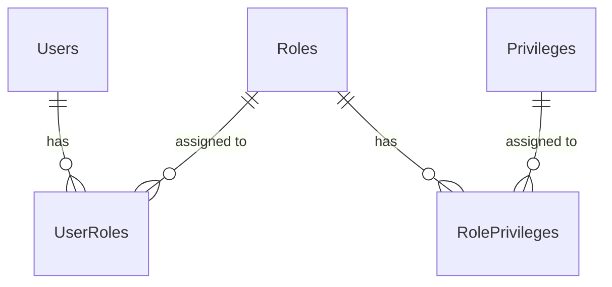

# 🔐 Role Management — Employee Management System

> A complete guide to **who can do what** in this project. Written in simple language so you can easily explain it to anyone.

---

## 📖 What is Role Management?

Think of **Role Management** like a **security pass system in an office building**. Different employees have different colored ID cards — some can enter all rooms (Admin), some can enter the HR department (HR), some can enter their team's room (Manager), and some can only enter their own desk area (Employee).

**Role Management controls WHO can do WHAT in the system.**

---

## 🎭 Roles in This Project (4 Roles)

| Role         | Think of them as...     | What they can do                                                                    |
| ------------ | ----------------------- | ----------------------------------------------------------------------------------- |
| **Admin**    | 🏢 The **Owner / CEO**  | Full system access — create, read, update, delete **anything**                      |
| **HR**       | 👔 The **HR Manager**   | Manage employees, attendance, leaves, salaries — all employee-related stuff         |
| **Manager**  | 👨‍💼 A **Team Leader**    | View their team, approve/reject team leaves, write performance reviews              |
| **Employee** | 🧑‍💻 A **Regular Worker** | Only see and manage their **own** stuff — profile, attendance, leaves, salary slips |

> **Note:** There is no separate "Employee Type" table. The **Roles** themselves act as employee types — they define what kind of user someone is and what they can access.

---

## 🗄️ Database Structure for Roles (5 Tables)

These 5 tables work together like a chain:

```
Users → UserRoles → Roles → RolePrivileges → Privileges
```

| Table              | Purpose                                                 | Example                                                     |
| ------------------ | ------------------------------------------------------- | ----------------------------------------------------------- |
| **Users**          | Stores login info (username, password, email)           | `{ Username: "kartik", PasswordHash: "abc123..." }`         |
| **Roles**          | Stores role names                                       | `{ RoleName: "Admin" }`, `{ RoleName: "HR" }`               |
| **UserRoles**      | Links a User to a Role (who has which role?)            | `{ UserId: 1, RoleId: 2 }` → "Kartik is HR"                 |
| **Privileges**     | Stores individual permissions                           | `{ PrivilegeName: "CanDeleteEmployee" }`                    |
| **RolePrivileges** | Links a Role to its Privileges (what can this role do?) | `{ RoleId: 2, PrivilegeId: 5 }` → "HR can delete employees" |

### ER Diagram



**In simple terms:**

> A **User** gets a **Role** → That **Role** has **Privileges** → Those **Privileges** decide what **actions** the user can perform.

---

## 📋 What Can Each Role Do? (Module by Module)

### 1. Authentication & Role Management

| Action                         | Admin | HR  | Manager | Employee |
| ------------------------------ | :---: | :-: | :-----: | :------: |
| Register / Login               |  ✅   | ✅  |   ✅    |    ✅    |
| Change own password            |  ✅   | ✅  |   ✅    |    ✅    |
| Create / Update / Delete Roles |  ✅   | ❌  |   ❌    |    ❌    |
| Create Privileges              |  ✅   | ❌  |   ❌    |    ❌    |
| Assign Privilege to Role       |  ✅   | ❌  |   ❌    |    ❌    |

> **Why only Admin?** Only the Admin should control who can do what. If anyone could create roles, it would be a security disaster!

---

### 2. Employee Management

| Action                         | Admin | HR  | Manager | Employee  |
| ------------------------------ | :---: | :-: | :-----: | :-------: |
| View all employees             |  ✅   | ✅  |   ❌    |    ❌     |
| View one employee by ID        |  ✅   | ✅  |   ❌    | Only self |
| Create new employee            |  ✅   | ✅  |   ❌    |    ❌     |
| Update employee details        |  ✅   | ✅  |   ❌    |    ❌     |
| Delete employee (soft delete)  |  ✅   | ❌  |   ❌    |    ❌     |
| Search employees (filters)     |  ✅   | ✅  |   ❌    |    ❌     |
| View employees by department   |  ✅   | ✅  |   ✅    |    ❌     |
| View employees under a manager |  ❌   | ❌  |   ✅    |    ❌     |
| Upload employee photo          |  ✅   | ✅  |   ❌    |    ❌     |
| View employee photo            |  ✅   | ✅  |   ✅    |    ✅     |
| View own profile (`/me`)       |  ❌   | ❌  |   ❌    |    ✅     |
| Update own profile (`/me`)     |  ❌   | ❌  |   ❌    |    ✅     |

> **Why?** HR handles employee data daily. Manager sees only their team. Employee sees only their own profile.

---

### 3. Department Management

| Action                         | Admin | HR  | Manager | Employee |
| ------------------------------ | :---: | :-: | :-----: | :------: |
| View all departments           |  ✅   | ✅  |   ✅    |    ✅    |
| View department by ID          |  ✅   | ✅  |   ✅    |    ✅    |
| Create department              |  ✅   | ✅  |   ❌    |    ❌    |
| Update department              |  ✅   | ✅  |   ❌    |    ❌    |
| Delete department              |  ✅   | ❌  |   ❌    |    ❌    |
| View employees in a department |  ✅   | ✅  |   ✅    |    ❌    |

---

### 4. Designation Management

| Action                 | Admin | HR  | Manager | Employee |
| ---------------------- | :---: | :-: | :-----: | :------: |
| View all designations  |  ✅   | ✅  |   ✅    |    ✅    |
| View designation by ID |  ✅   | ✅  |   ✅    |    ✅    |
| Create designation     |  ✅   | ✅  |   ❌    |    ❌    |
| Update designation     |  ✅   | ✅  |   ❌    |    ❌    |
| Delete designation     |  ✅   | ❌  |   ❌    |    ❌    |

---

### 5. Attendance & Time Tracking

| Action                           | Admin | HR  | Manager | Employee |
| -------------------------------- | :---: | :-: | :-----: | :------: |
| Check-in / Check-out             |  ❌   | ❌  |   ❌    |    ✅    |
| View own attendance              |  ❌   | ❌  |   ❌    |    ✅    |
| View any employee's attendance   |  ✅   | ✅  |   ✅    |    ❌    |
| View department attendance       |  ✅   | ✅  |   ✅    |    ❌    |
| View today's attendance summary  |  ✅   | ✅  |   ❌    |    ❌    |
| Correct/update attendance record |  ✅   | ✅  |   ❌    |    ❌    |
| Monthly attendance report        |  ✅   | ✅  |   ❌    |    ❌    |

---

### 6. Leave Management

| Action                      | Admin | HR  | Manager | Employee |
| --------------------------- | :---: | :-: | :-----: | :------: |
| View all leave types        |  ✅   | ✅  |   ✅    |    ✅    |
| Create / Update leave types |  ✅   | ✅  |   ❌    |    ❌    |
| Delete leave types          |  ✅   | ❌  |   ❌    |    ❌    |
| Apply for leave             |  ❌   | ❌  |   ❌    |    ✅    |
| View own leave requests     |  ❌   | ❌  |   ❌    |    ✅    |
| View own leave balance      |  ❌   | ❌  |   ❌    |    ✅    |
| Cancel own leave            |  ❌   | ❌  |   ❌    |    ✅    |
| View leaves by employee     |  ✅   | ✅  |   ✅    |    ❌    |
| View pending leave requests |  ✅   | ✅  |   ✅    |    ❌    |
| Approve a leave request     |  ✅   | ✅  |   ✅    |    ❌    |
| Reject a leave request      |  ✅   | ✅  |   ✅    |    ❌    |
| Leave summary report        |  ✅   | ✅  |   ❌    |    ❌    |

> **Important:** A Manager can only approve/reject leaves **for their own team members**, not for everyone!

---

### 7. Payroll & Salary

| Action                    | Admin | HR  | Manager | Employee |
| ------------------------- | :---: | :-: | :-----: | :------: |
| Generate monthly salaries |  ✅   | ✅  |   ❌    |    ❌    |
| View own salary slip      |  ❌   | ❌  |   ❌    |    ✅    |
| View salary by employee   |  ✅   | ✅  |   ❌    |    ❌    |
| View all salary records   |  ✅   | ✅  |   ❌    |    ❌    |
| Update/correct a salary   |  ✅   | ❌  |   ❌    |    ❌    |
| Yearly salary report      |  ✅   | ❌  |   ❌    |    ❌    |

---

### 8. Performance Reviews

| Action                       | Admin | HR  | Manager | Employee  |
| ---------------------------- | :---: | :-: | :-----: | :-------: |
| Create a performance review  |  ❌   | ✅  |   ✅    |    ❌     |
| View reviews for an employee |  ✅   | ✅  |   ✅    | Only self |
| View own reviews (`/me`)     |  ❌   | ❌  |   ❌    |    ✅     |
| Update a review              |  ❌   | ✅  |   ✅    |    ❌     |
| Delete a review              |  ✅   | ❌  |   ❌    |    ❌     |
| Department review summary    |  ✅   | ✅  |   ❌    |    ❌     |

---

### 9. Notifications

| Action                          | Admin | HR  | Manager | Employee |
| ------------------------------- | :---: | :-: | :-----: | :------: |
| View own notifications          |  ✅   | ✅  |   ✅    |    ✅    |
| Mark as read / Mark all as read |  ✅   | ✅  |   ✅    |    ✅    |
| Delete a notification           |  ✅   | ✅  |   ✅    |    ✅    |
| Broadcast to all employees      |  ✅   | ✅  |   ❌    |    ❌    |

---

### 10. Dashboard & Reports

| Action                           | Admin | HR  | Manager | Employee |
| -------------------------------- | :---: | :-: | :-----: | :------: |
| View dashboard summary           |  ✅   | ✅  |   ❌    |    ❌    |
| Attendance overview (charts)     |  ✅   | ✅  |   ❌    |    ❌    |
| Department stats                 |  ✅   | ✅  |   ❌    |    ❌    |
| Leave stats                      |  ✅   | ✅  |   ❌    |    ❌    |
| Salary stats                     |  ✅   | ❌  |   ❌    |    ❌    |
| Export employee list (CSV/Excel) |  ✅   | ✅  |   ❌    |    ❌    |
| Export attendance report         |  ✅   | ✅  |   ❌    |    ❌    |
| Export salary report             |  ✅   | ❌  |   ❌    |    ❌    |

---

## ❓ When / Where / Why / How?

| Question                    | Answer                                                                                                                                                                                                     |
| --------------------------- | ---------------------------------------------------------------------------------------------------------------------------------------------------------------------------------------------------------- |
| **When** is a role checked? | **Every time** a user calls an API endpoint. The JWT token contains the user's role, and the server checks it before allowing access.                                                                      |
| **Where** is it checked?    | In the **Controller** layer using `[Authorize(Roles = "Admin")]` attributes. The server reads the JWT token from the HTTP request header.                                                                  |
| **Why** do we need roles?   | **Security!** Without roles, any employee could delete other employees, change salaries, or view confidential data. Roles keep the system safe and organized.                                              |
| **How** does it work?       | 1. User **logs in** → gets a **JWT token** with their role inside it. 2. User sends the token with every API request. 3. Server **reads the token**, checks the role, and **allows or blocks** the action. |

---

## 🔄 Complete Role Flow (Step by Step)

```
1. Admin creates Roles (Admin, HR, Manager, Employee)
         ↓
2. Admin creates Privileges (CanCreateEmployee, CanApproveLeave, etc.)
         ↓
3. Admin assigns Privileges to Roles (HR gets CanCreateEmployee)
         ↓
4. A new User registers → Admin assigns a Role to the User
         ↓
5. User logs in → Server returns a JWT Token (contains UserId + Role)
         ↓
6. User calls an API (e.g., DELETE /api/employees/5)
         ↓
7. Server reads the token → Checks: "Does this user's role allow DELETE?"
         ↓
8. ✅ If allowed → Action performed
   ❌ If not allowed → 403 Forbidden error returned
```

---

## 🧑‍💻 How Employees Are Categorized

There is **no separate "Employee Type" table**. Instead, employees are categorized in **3 different ways**:

| How?             | Table                 | Purpose                                     | Example                           |
| ---------------- | --------------------- | ------------------------------------------- | --------------------------------- |
| **Roles**        | `Roles` + `UserRoles` | Controls **what they can do** (permissions) | Admin, HR, Manager, Employee      |
| **Departments**  | `Departments`         | Controls **where they work**                | IT, HR, Finance, Marketing        |
| **Designations** | `Designations`        | Controls **their job title**                | Software Engineer, Team Lead, CEO |

### Example

```
Employee "Kartik"
  ├── Role:        Employee            → (can view own profile, mark attendance)
  ├── Department:  IT                  → (belongs to the IT team)
  └── Designation: Software Engineer   → (his job title)
```

---

## 🎯 Quick Summary (Explain to Anyone)

> _"Our EMS has 4 roles — Admin, HR, Manager, and Employee. Each role has different permissions. Admin can do everything. HR manages employee data and payroll. Manager handles their team's leaves and reviews. Employee can only manage their own stuff like attendance and leaves. When a user logs in, they get a JWT token that says who they are and what role they have. Every time they try to do something, the system checks their role and either allows or blocks the action. This keeps the system secure — nobody can access more than they should."_

---

> 📝 **This documentation is based on the [EMS_Documentation.md](file:///d:/Projects/EmployeeManagementSystem/EMS_Documentation.md) project specification.**
